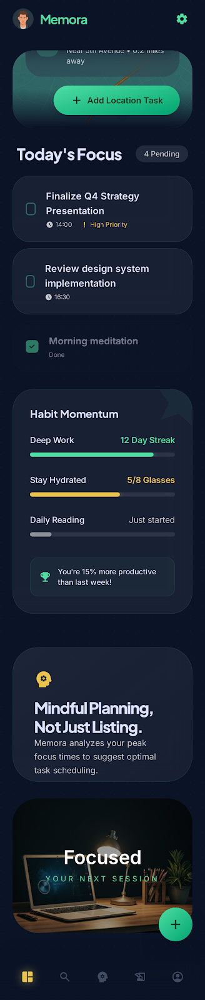
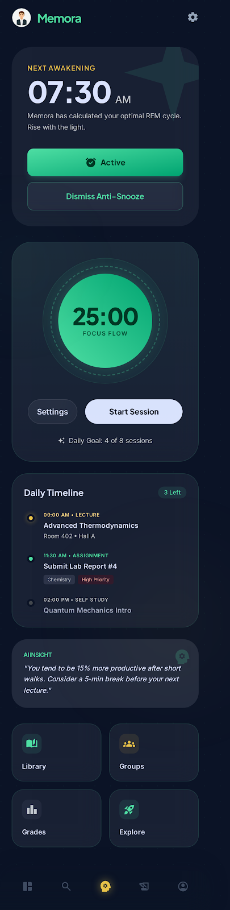
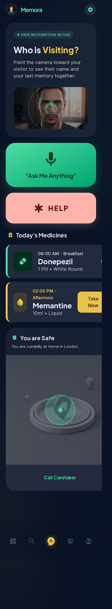

# Memora AI Assistant

Memora is a sophisticated, multi-modal AI companion designed to provide personalized cognitive support, focus optimization, and daily assistance for Students, General users, and individuals with Alzheimer’s.

## 📸 Visual Showcase

| General Intelligence | Focus & Study | Cognitive Support |
| :---: | :---: | :---: |
|  |  |  |

---

## 🚀 Core Features

*   **🎭 Multi-Modal Personalization:** Three distinct application modes (Student, General, Alzheimer's) with dedicated UI/UX tailored to specific cognitive needs.
*   **🧠 Real-Time Gemini AI:** State-aware conversational intelligence leveraging Google's Gemini models, providing proactive reminders and contextual memory.
*   **🗺️ Deep-Dive Navigation:** A robust nested routing architecture built with `go_router`, featuring a persistent navigation shell and stateful branches.
*   **📱 Responsive & Fluid Design:** Implementation of a custom typography scaling engine and glassmorphism-inspired components that adapt perfectly across all screen sizes.
*   **🛡️ Robust Error Handling:** Advanced `Failure` mapping system for Dio and Gemini SDKs using functional programming patterns (Dartz/Either) to ensure zero-crash stability.

---

## 🏗️ Architecture Overview

Memora is built following **Clean Architecture** principles, strictly decoupling logic into three layers to ensure maximum scalability, testability, and maintainability:

*   **Data Layer:** Handles API integrations (Gemini, Dio), local persistence, and data mapping through Repositories and DataSources.
*   **Domain Layer:** The pure logic core containing Entities, UseCases, and Repository interfaces.
*   **Presentation Layer:** State management using BLoC/Cubit and a highly modularized UI component library.

---

## 🛠️ Tech Stack Summary

| Tech | Library / Pattern |
| --- | --- |
| **Framework** | Flutter |
| **State Management** | BLoC / Cubit |
| **Dependency Injection** | Get_it |
| **Navigation** | GoRouter (Stateful Shell) |
| **AI Engine** | Google Gemini Generative AI |
| **Network** | Dio |
| **Functional Programming** | Dartz (Either Pattern) |

---

## 🏁 How to Get Started

1.  **Clone the Repository:**
    ```bash
    git clone https://github.com/ahned2ismail/Memora_ai_assistant
    cd memora_ai_assistant
    ```

2.  **Install Dependencies:**
    ```bash
    flutter pub get
    ```

3.  **Environment Setup:**
    Create a `.env` file in the root directory and add your Gemini API Key:
    ```env
    GEMINI_API_KEY=your_api_key_here
    ```

4.  **Run the App:**
    ```bash
    flutter run
    ```

---

## 📂 Project Structure

```text
lib/
├── core/                  # Shared theme, routing, error handling, and utilities
│   ├── errors/            # Advanced Failure & Exception system
│   ├── routes/            # GoRouter configuration
│   └── theme/             # AppStyles & AppColors
├── di/                    # Dependency Injection (Get_it)
├── features/              # Feature-specific modules
│   ├── ai_assistant/      # Gemini AI integration & Chat UI
│   ├── home/              # Multi-modal dashboards & detail pages
│   ├── onboarding/        # Entrance flow & profile selection
│   └── settings/          # Pricing, account, and configuration
└── main.dart              # Entry point
```

---

## ⚙️ Engineering Highlights

### 🚄 The Adaptive Engine
Memora features a highly adaptive UI architecture that ensures a pixel-perfect experience across all device sizes. By leveraging a combination of **`LayoutBuilder`**, **`SingleChildScrollView`**, **`ConstrainedBox`**, and **`IntrinsicHeight`**, the application:
- **Prevents Bottom Overflows**: Content automatically expands and permits scrolling on small devices.
- **Maintains Proportional Balance**: On large screens or tablets, bento-grid components stay elegantly centered and proportionally scaled without manual adjustments.

### 🛡️ Robust Error Handling
The project implements an enterprise-grade error handling system that prioritizes user stability. Utilizing the **`Either` pattern from `Dartz`**, we've refactored all repository and data layers to strictly manage failures:
- **Dio & Gemini Integration**: Exhaustive mapping of `DioException` and `GenerativeAIException`.
- **Informative Failures**: Instead of generic crashes or empty states, the app propagates typed `ServerFailure` and `GeminiFailure` objects, resulting in context-aware UI feedback (e.g., specific chat bubbles for safety blocks or rate limits).

### 📐 Responsive Typography
Unlike standard responsive apps, Memora uses a custom clamping logic in **`AppStyles`** that ensures text is never too small on mobile nor excessively large on tablets, maintaining a premium, high-end aesthetic.

---

## 🏆 Project Maturity
The codebase has undergone a comprehensive **Deep System Health Check** and is currently **100% bug-free** with **Zero Issues** (0 errors, 0 warnings) in static analysis.

- **DI Integrity**: Fully verified with exhaustive registrations.
- **State Management**: Robust BLoC state transitions with failure-bubble protection.
- **Route Safety**: Null-safe GoRouter parameter parsing for all deep-links.

---

*Built with ❤️ for a more mindful future.*
